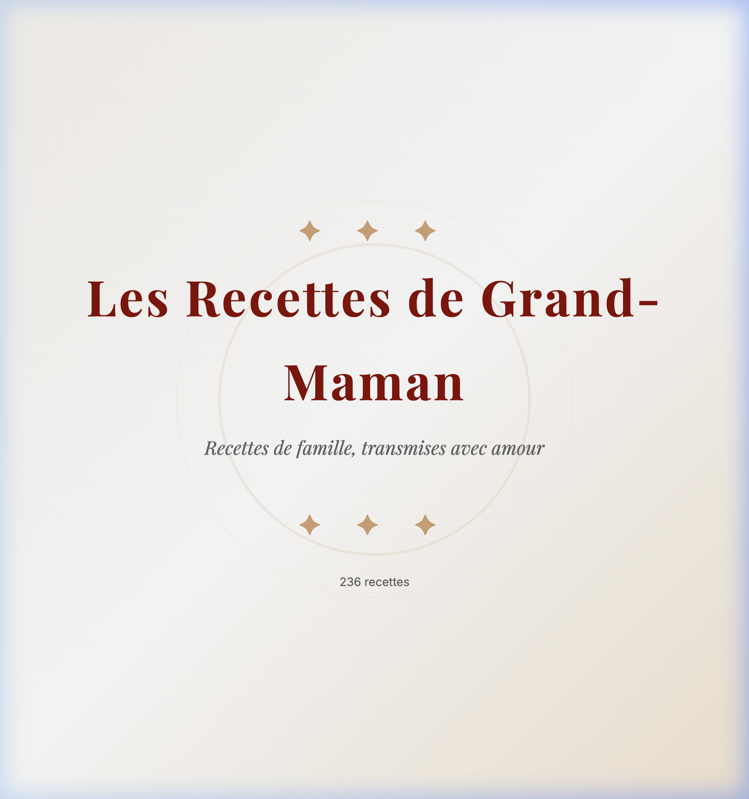
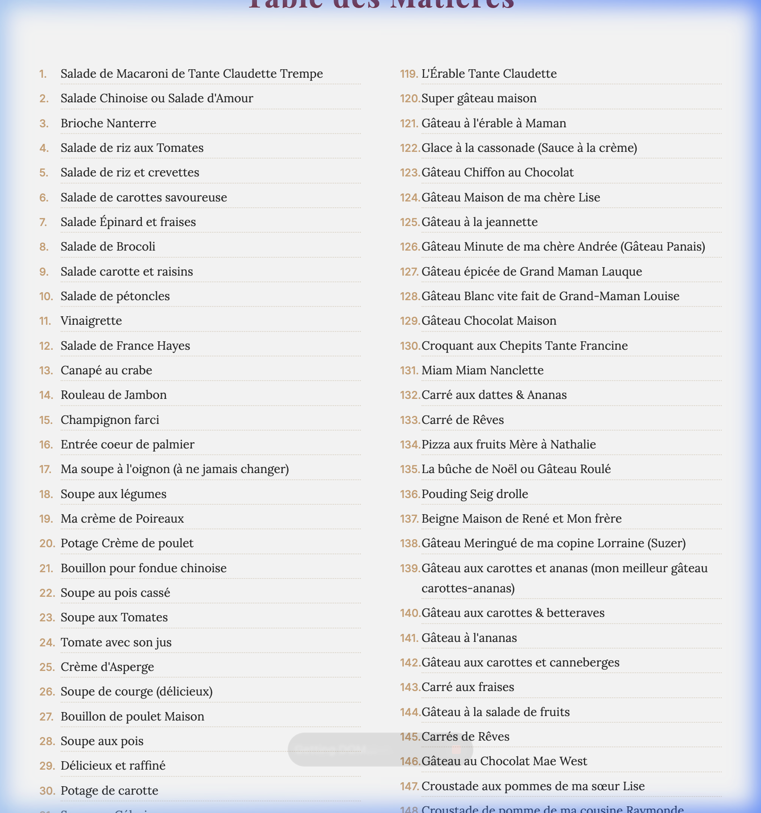
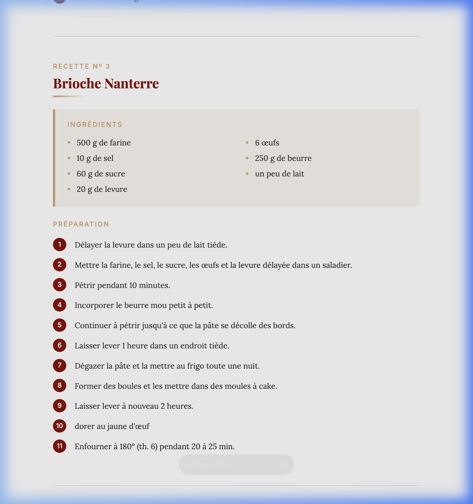

# 📖 Handwritten French Recipe Transcriber

I had a 180-page handwritten notebook full of my grandmother's French-Canadian cooking recipes, and I wanted to turn it into a proper book. So I built this — an AI-powered pipeline that reads handwritten French recipes from scanned photos and produces a beautifully formatted digital cookbook, **using only free AI models**.

<p align="center">
  
</p>

---

## ✨ What It Does

Starting from raw photos of handwritten recipe pages, this pipeline:

1. **Transcribes** each handwritten page using free AI vision models (Google Gemini free tier + Ollama local models)
2. **Parses** the transcribed text into structured recipe data (title, ingredients, preparation steps, notes)
3. **Validates & corrects** the parsed recipes using a free LLM quality-check pass
4. **Generates** a beautifully styled HTML cookbook with cover page, table of contents, and individually formatted recipe cards

The entire pipeline runs on **free-tier APIs and open-source local models** — no paid subscriptions required.

The result? **236 family recipes** — from *Soupe à l'oignon* to *Bœuf Bourguignon* — preserved in a digital format that can be searched, printed, and shared.

---

## 🖼️ Output Examples

### Table of Contents
<p align="center">
  
</p>

### Recipe Card
<p align="center">
  
</p>

---

## 🏗️ Architecture

The project is a **4-stage pipeline**, each stage being an independent Python script:

```
┌─────────────────┐     ┌──────────────────┐     ┌──────────────────┐     ┌──────────────────┐
│  transcribe.py  │────▶│  parse_recipes.py │────▶│validate_recipes.py────▶│generate_cookbook.py│
│                 │     │                  │     │                  │     │                  │
│ Photos → PDF    │     │ PDF → JSON       │     │ JSON → JSON      │     │ JSON → HTML      │
│ (AI Vision OCR) │     │ (LLM Extraction) │     │ (LLM Correction) │     │ (Styled Cookbook) │
└─────────────────┘     └──────────────────┘     └──────────────────┘     └──────────────────┘
```

### Stage 1: `transcribe.py` — Image → PDF

Transcribes handwritten notebook page images into a clean, Markdown-formatted PDF.

- **Image preprocessing**: CLAHE contrast enhancement, sharpening, upscaling for better OCR
- **Multi-model fallback**: Gemini Flash → Ollama (qwen3.5:397b-cloud) → Gemini 2.0 Flash
- **Hallucination detection**: Validates transcriptions aren't English, aren't repetitive, and aren't AI commentary
- **Sleep/wake recovery**: Detects macOS sleep cycles and automatically resets stale connections
- **Resume support**: Progress saved after each page — survives crashes, reboots, and interruptions
- **Background mode**: Runs via `caffeinate` + `nohup` to survive terminal closure and prevent Mac sleep

### Stage 2: `parse_recipes.py` — PDF → JSON

Extracts structured recipe data from the transcription PDF.

- **Text chunking**: Splits the merged transcription into individual recipe chunks using heading detection
- **LLM-powered extraction**: Each chunk is sent to an AI model that returns structured JSON with `titre`, `ingredients`, `preparation`, and `notes`
- **Multi-provider support**: Gemini, Ollama, and OpenRouter API backends
- **Deduplication**: Detects and merges duplicate recipes, keeping the most complete version
- **Resume support**: Can restart from where it left off using a progress file

### Stage 3: `validate_recipes.py` — JSON → Corrected JSON

Quality-checks and corrects the parsed recipe data.

- **Batch processing**: Sends recipes in batches of 5 to an LLM for validation
- **Corrections include**: Fixing French spelling, standardizing measurements, separating merged ingredients, repairing garbled text
- **Resume support**: Tracks which batches have been processed

### Stage 4: `generate_cookbook.py` — JSON → HTML Cookbook

Generates a beautifully typeset HTML cookbook.

- **Professional design**: Playfair Display + Lora fonts, warm color palette, elegant recipe cards
- **Cover page**: Title, subtitle, total recipe count with decorative ornaments
- **Table of contents**: Two-column layout with all 236 recipes
- **Print-ready**: Optimized `@media print` styles with page-break controls
- **Sortable recipes**: Numbered and organized sequentially

---

## 🚀 Getting Started

### Prerequisites

- **Python 3.10+**
- **Gemini API Key** — free, no credit card needed ([Google AI Studio](https://aistudio.google.com/apikey))
- **Ollama** (optional free fallback — [install here](https://ollama.com))

> 💡 **100% free** — all models used in this project are available on free tiers or run locally via Ollama.

### Installation

```bash
# Clone the repository
git clone https://github.com/jeremyprincerich/Handwritten-French-Recipe-Transcriber.git
cd Handwritten-French-Recipe-Transcriber

# Install dependencies
pip install -r requirements.txt
```

### Usage

#### 1. Transcribe handwritten pages to PDF

Place your scanned notebook photos in a directory, then:

```bash
# Set your API key
export GEMINI_API_KEY="your-key-here"

# Basic transcription
python transcribe.py ./notebook_photos

# Run in background (survives terminal close, prevents Mac sleep)
python transcribe.py ./notebook_photos --background

# Monitor progress
tail -f transcription.log
```

#### 2. Parse the transcription PDF into structured JSON

```bash
# Using Gemini
python parse_recipes.py transcription.pdf --gemini-key "$GEMINI_API_KEY"

# Or using OpenRouter
python parse_recipes.py transcription.pdf --openrouter-key "$OPENROUTER_API_KEY"

# From multiple PDFs
python parse_recipes.py part1.pdf part2.pdf part3.pdf --gemini-key "$GEMINI_API_KEY"
```

#### 3. Validate and correct the recipes

```bash
python validate_recipes.py recipes.json --openrouter-key "$OPENROUTER_API_KEY"
```

#### 4. Generate the HTML cookbook

```bash
python generate_cookbook.py recipes_final.json

# Custom title
python generate_cookbook.py recipes_final.json --title "Les Recettes de Grand-Maman" --subtitle "Recettes de famille, transmises avec amour"

# Specify output file
python generate_cookbook.py recipes_final.json -o my_cookbook.html
```

---

## 📁 Project Structure

```
├── transcribe.py            # Stage 1: Handwritten image → PDF transcription
├── parse_recipes.py         # Stage 2: PDF → structured JSON recipes
├── validate_recipes.py      # Stage 3: LLM-based recipe validation & correction
├── generate_cookbook.py      # Stage 4: JSON → styled HTML cookbook
├── requirements.txt         # Python dependencies
├── docs/                    # Screenshots for README
│   ├── cookbook_cover.png
│   ├── cookbook_toc.png
│   └── recipe_card.png
└── README.md
```

---

## 📊 JSON Data Format

Each recipe in the output JSON follows this structure:

```json
{
  "titre": "Brioche Nanterre",
  "ingredients": [
    "500 g de farine",
    "10 g de sel",
    "60 g de sucre",
    "20 g de levure",
    "6 œufs",
    "250 g de beurre",
    "un peu de lait"
  ],
  "preparation": [
    "Délayer la levure dans un peu de lait tiède.",
    "Mettre la farine, le sel, le sucre, les œufs et la levure délayée dans un saladier.",
    "Pétrir pendant 10 minutes.",
    "Incorporer le beurre mou petit à petit.",
    "Laisser lever 1 heure dans un endroit tiède.",
    "Enfourner à 180° (th. 6) pendant 20 à 25 min."
  ],
  "notes": null,
  "numero": 3
}
```

---

## 🔧 Configuration

### API Keys

| Variable | Purpose | Required |
|---|---|---|
| `GEMINI_API_KEY` | Google Gemini vision models (transcription + parsing) | For stages 1 & 2 |
| `OPENROUTER_API_KEY` | OpenRouter API (parsing + validation) | For stages 2 & 3 |

### Model Chain

The transcription stage uses a fallback chain of vision models. You can customize it:

```bash
# Default chain
python transcribe.py ./photos --models gemini:gemini-3-flash-preview ollama:qwen3.5:397b-cloud

# Gemini-only
python transcribe.py ./photos --models gemini:gemini-3-flash-preview

# Ollama-only (no API key needed)
python transcribe.py ./photos --models ollama:llama3.2-vision
```

---

## 📝 License

This project is open source and available under the [MIT License](LICENSE).

---

## 🙏 Acknowledgments

Built to preserve **Les Recettes de Grand-Maman** — a 180-page handwritten French-Canadian recipe notebook passed down through generations. 236 recipes, from salads to desserts, now digitized and shareable with the whole family. The entire project was completed using only free AI models.

*Recettes de famille, transmises avec amour.* ❤️
